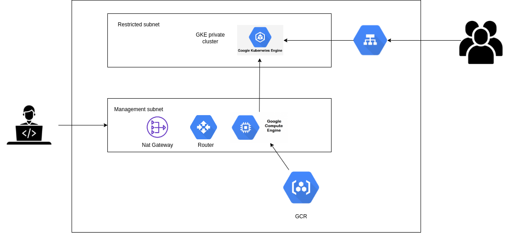

# GCP-Project


This is a google cloud project aims to deploy an application on GKE cluster while this cluster is private and creating kubernetes objects is only allowed from a private instance .\
-a nat gateway is created to allow accessing that private instance.\
-a bucket is created and yaml files is uploaded to it.
####
two subnets is created.\
-Management subnet has the following:\
NAT gateway\
Private VM

-Restricted subnet has the following:\
Private standard GKE cluster
####
application used : https://github.com/atefhares/DevOps-Challenge-Demo-Code


### Build a docker image and upload it to your gcr:

#### -run these commands while you are in app directory:
  ```
  docker build -t gcp-python .
  ```
  ```
  docker tag gcp-python gcr.io/able-starlight-375707/gcp-python
  ```
  ```
  docker push gcr.io/able-starlight-375707/gcp-python
  ```

### Pull redis image and upload it to your gcr:
  
  ```
  docker pull redis
  ```
  ```
  docker tag redis gcr.io/able-starlight-375707/redis-gcr
  ```
  ```
  docker push gcr.io/able-starlight-375707/redis-gcr
  ```
  
  
### Create a bucket and upload yaml files to your gcr:
  ```
  gsutil mb -p able-starlight-375707 gs://k8s-yaml-files
  ```
  ```
  gsutil cp -r /home/abdelkhalek97/Desktop/GCP-Project/k8s_files gs://k8s-yaml-files
  ```
  
### Apply Terraform code :
  
  ```
  terraform init
  ```
  ```
  terraform plan
  ```
  ```
  terraform apply
  ```

## Important Note:
My project name in gcp is : able-starlight-375707 \
My bucket name in gcp is : k8s-yaml-files
#### -In order for this project to work you will need to change these variables to match your own gcp info.
  #### -you will find these variables in :
  /k8s_files/python-app-deployment.yml\
  /k8s_files/redis-deploymet.yml\
  /bash.sh\
  /main.tf\
  /provider.tf
  
-Add your credentials in provider.tf and move your .json file in GCP-Project directory
